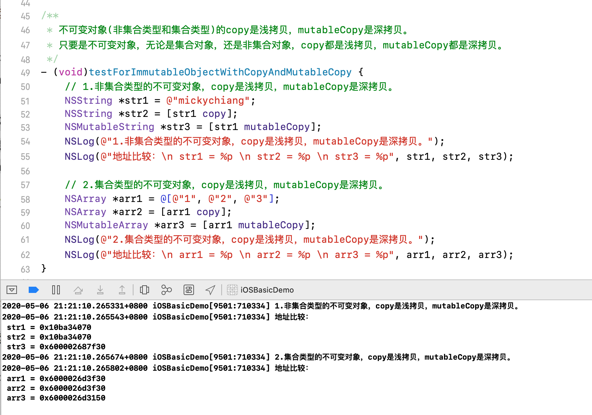
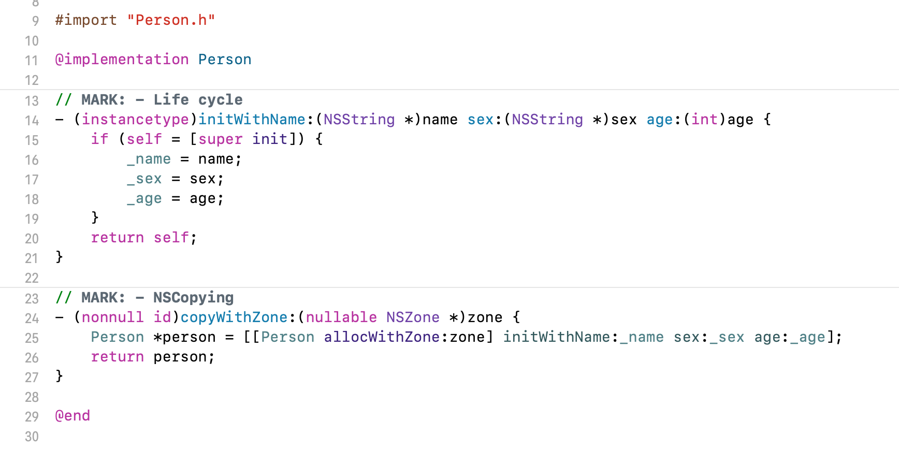
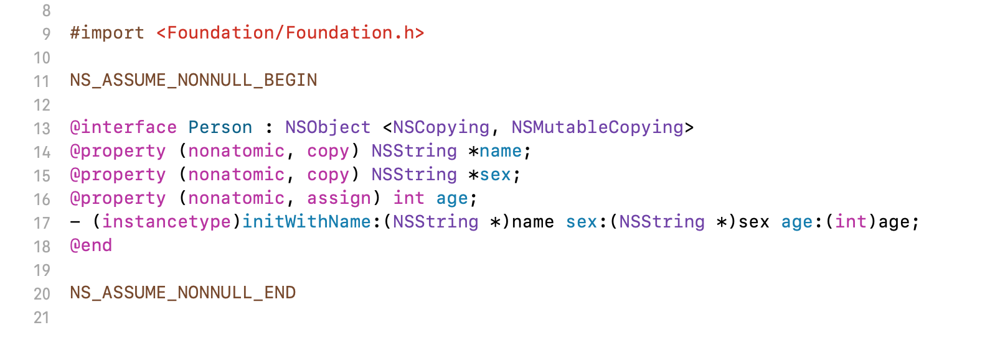
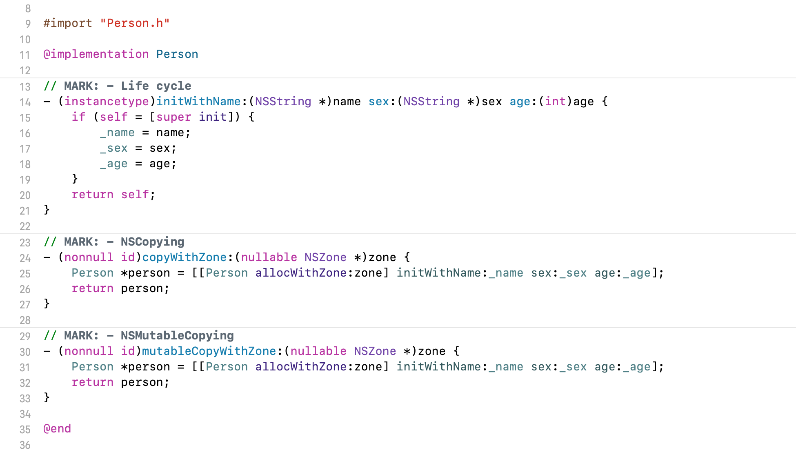
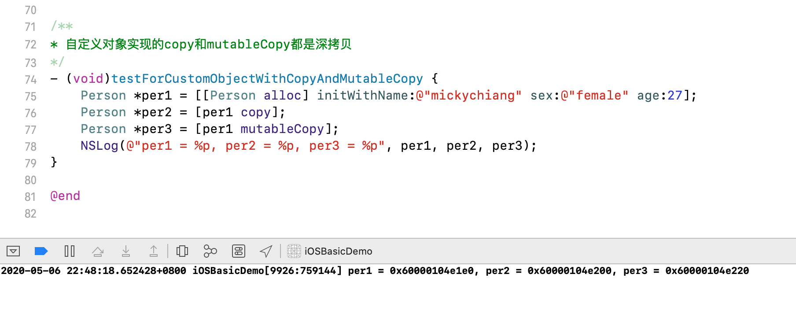

# iOS面试题备忘录(一)属性关键字
所有源码基于[objc-runtime-objc.680版本](https://opensource.apple.com/source/objc4/)
https://images.ac.cn/cn.html?btwaf=61224463

# 前言
《iOS面试题备忘录(一)属性关键字》是关于iOS的属性关键字相关的知识点及面试题的整理。  
本篇内容会一直持续整理并完善，有理解不正确的地方请路过的大神告知，共勉。  
[github原文地址](https://github.com/mickychiang/iOSInterviewMemo/blob/master/InterviewSummary/PropertyModifier.md)

<span id="jump"><h1>目录</h1></span>

[<span id="jump-1"><h2>一. 深拷⻉和浅拷⻉</h2></span>](#1)
[<span id="jump-1-1">1. OC对象的拷贝方式有哪些？(浅拷贝和深拷贝是什么？)</span>](#1-1)   
[<span id="jump-1-2">2. OC对象实现的copy和mutableCopy分别为浅拷贝还是深拷贝？</span>](#1-2)  
[<span id="jump-1-3">3. 自定义对象实现的copy和mutableCopy分别为浅拷贝还是深拷贝？</span>](#1-3)  
[<span id="jump-1-4">4. 判断当前的深拷贝的类型？(区别是单层深拷贝还是完全深拷贝)，2种深拷贝类型的相互转换？</span>](#1-4)  
[<span id="jump-1-5">5. 代码如下所示：既然对象的mutableCopy是深拷贝，那为什么更改dataArray2，dataArray3也发生了改变？如何解决这个问题？</span>](#1-5) 
<!--  -->

<!--     -->

[<span id="jump-1-6">6. 代码如下图所示：initWithArray:copyItems:YES 仅仅能进行一层深拷贝，对于第二层或者更多层的就无效了。如果想要对象每层都是深拷贝，该怎么做？</span>](#1-6)
<!--  -->

<!--  -->


[<span id="jump-2"><h2>二. 属性关键字</h2></span>](#2)
[<span id="jump-2-1">1. 常用的基本类型对应Foundation数据类型？</span>](#2-1)  
[<span id="jump-2-2">2. 定义属性的格式？(定义属性时修饰符的顺序？)</span>](#2-2)  
[<span id="jump-2-3">3. ARC下@property的默认属性？</span>](#2-3)  
[<span id="jump-2-4">4. 属性的读写权限关键字的含义？</span>](#2-4)  
[<span id="jump-2-5">5. 属性的原子操作关键字的含义？</span>](#2-5)  
[<span id="jump-2-6">6. 属性的内存管理(引用计数)关键字的含义？</span>](#2-6)  
[<span id="jump-2-7">7. assign和weak的比较？分别的使用场景？</span>](#2-7)  
[<span id="jump-2-8">8. delegate应该使用哪种关键字修饰？</span>](#2-8)  
[<span id="jump-2-9">9. 如果说weak指针指向一个对象，当这个对象dealloc或废弃之后，它的weak指针为何会被自动设置为nil?(当⼀个对象被释放或废弃，weak变量是怎样处理的呢?)</span>](#2-9)  
[<span id="jump-2-10">10. 为什么assign可以修饰基本数据类型?(为何assign修饰基本数据类型没有野指针的问题?)</span>](#2-10)  
[<span id="jump-2-111">11. 修饰符strong和weak的比较？</span>](#2-11)  
[<span id="jump-2-12">12. strong和copy关键字的用法？</span>](#2-12)  
[<span id="jump-2-13">13. 以下属性的声明有什么问题？如果一定要这么定义，如何修改成正确的呢？</span>](#2-13)  
```
@property (nonatomic, copy) NSMutableArray *mutableArray;
```
[<span id="jump-2-14">14. 以下属性的声明有什么问题？如果一定要这么定义，如何修改成正确的呢？</span>](#2-14)  
```
@property (nonatomic, strong) NSArray *array;
```
[<span id="jump-2-15">15. 为什么@property属性用copy修饰不可变对象，而用strong修饰可变对象呢？</span>](#2-15)  
[<span id="jump-2-16">16. 为什么用copy关键字来修饰block？</span>](#2-16)   
[<span id="jump-2-17">17. MRC下如何重写retain修饰变量的setter方法？不等判断的目的？</span>](#2-17) 


# 正文
<h2 id="1">一. 深拷⻉和浅拷⻉</h2>

<h3 id="1-1">1. OC对象的拷贝方式有哪些？(浅拷贝和深拷贝是什么？)</h3>

OC对象(集合类型和非集合类型)有2种拷贝方式，分别为浅拷贝和深拷贝。

<!--  -->


- 浅拷贝：指针拷贝，即源对象和副本对象的指针指向了同一个区域。  
- 深拷贝：内容拷贝，即源对象和副本对象的指针分别指向不同的两块区域。  
**深拷贝包括了单层深拷贝和完全深拷贝。**(具体内容参考面试题4、5、6)  
    - 单层深拷贝：对于副本对象本身这一层是深拷贝，它里面的所有对象都是浅拷贝。  
    - 完全深拷贝：对于副本对象本身以及它里面的所有对象都是深拷贝。 

浅拷贝和深拷贝的区别：
- 是否开辟了新的内存空间
- 是否影响了引用计数

[回到目录](#jump-1)


<h3 id="1-2">2. OC对象实现的copy和mutableCopy分别为浅拷贝还是深拷贝？</h3>

- 可变对象(集合类型/非集合类型)的copy和mutableCopy都是深拷贝。
- 不可变对象(集合类型/非集合类型)的copy是浅拷贝，mutableCopy是深拷贝。
- copy方法返回的都是不可变对象。

<!--  -->


**具体实现如下：**  
1). 可变对象(集合类型/非集合类型)的copy和mutableCopy都是深拷贝。

<!--  -->


2). 不可变对象(集合类型/非集合类型)的copy是浅拷贝，mutableCopy是深拷贝。

<!--  -->


[回到目录](#jump-1)


<h3 id="1-3">3. 自定义对象实现的copy和mutableCopy分别为浅拷贝还是深拷贝？</h3>

自定义对象实现的copy和mutableCopy，都是深拷贝。  
自定义对象遵守NSCopying和NSMutableCopying协议，来实现copyWithZone:和mutableCopyWithZone:两个方法。  

**具体实现如下：**   
1). **自定义对象的copy是深拷贝：自定义对象实现的copy，要遵守NSCopying协议，且实现copyWithZone:方法。**
- 遵守NSCopying协议
<!--  -->


- 实现CopyWithZone⽅法
<!--  -->


- 自定义对象实现的copy，是深拷⻉。
<!--  -->


2). **自定义对象的mutableCopy是深拷贝：⾃定义对象实现的mutableCopy，要遵守NSMutableCopying协议，且实现mutableCopyWithZone:方法。**

- 遵守NSMutableCopying协议
<!--  -->


- 实现mutableCopyWithZone⽅法
<!--  -->


- ⾃定义对象实现的mutableCopy，是深拷贝。
<!--  -->


[回到目录](#jump-1)


<h3 id="1-4">4. 判断当前的深拷贝的类型？(区别是单层深拷贝还是完全深拷贝)，2种深拷贝类型的相互转换？</h3>

- 单层深拷贝：对于副本对象本身这一层是深拷贝，它里面的所有对象都是浅拷贝。
- 完全深拷贝：对于副本对象本身以及它里面的所有对象都是深拷贝。  

**实现方式：**
- 单层深拷贝：使用**initWithArray:copyItems:方法(第二个参数设置为YES)**。
- 完全深拷贝：**归档和解档**来实现完全深拷贝。  
举例：dataArray3 = [NSKeyedUnarchiver unarchiveObjectWithData:[NSKeyedArchiver archivedDataWithRootObject:dataArray2]];

[回到目录](#jump-1)


<h3 id="1-5">5. 代码如下所示：既然对象的mutableCopy是深拷贝，那为什么更改dataArray2，dataArray3也发生了改变？如何解决这个问题？</h3>

<!--  -->


<!--  -->


问题(1). 对象的mutableCopy是深拷贝，那为什么更改dataArray2，dataArray3也发生了改变？
```  
dataArray3 = [dataArray2 mutableCopy];  
mutableCopy只是对数组dataArray2本身进行了内容拷贝，但是里面的字符串对象却没有进行内容拷贝，而是浅拷贝。  
即dataArray2和dataArray3里面的字符串对象是共享同一份的，所以才会出现上面的情况。  
```
问题(2). 如何解决这个问题？
> 使用initWithArray:copyItems:方法，第二个参数设置为YES。
如果以这种方式创建集合的深层副本，则会向集合中的每个对象发送copyWithZone:消息。
如果集合中的对象已采用NSCopying协议，则这些对象将被深深复制到新集合中，而新集合则是复制对象的唯一所有者。
如果对象不采用NSCopying协议，尝试以这种方式复制它们会导致运行时错误。但是，copyWithZone:生成浅拷贝。
这种拷贝只能产生一层深拷贝，对于第二层或者更多层的就无效了。
```
dataArray3 = [[NSMutableArray alloc] initWithArray:dataArray2 copyItems:YES];
因为dataArray2里面的字符串对象已经遵守了NSCopying协议，所以这些字符串对象将被深深复制到dataArray3中，而dataArray3则是复制对象的唯一所有者。
即dataArray2和dataArray3里面的字符串对象是不同的。
```

[回到目录](#jump-1)


<h3 id="1-6">6. 代码如下图所示：initWithArray:copyItems:YES 仅仅能进行一层深拷贝，对于第二层或者更多层的就无效了。如果想要对象每层都是深拷贝，该怎么做？</h3>

<!--  -->


<!--  -->


使用**归档和解档**来实现对象的**完全深拷贝。**
```
dataArray3 = [NSKeyedUnarchiver unarchiveObjectWithData:[NSKeyedArchiver archivedDataWithRootObject:dataArray2]];
```

[回到目录](#jump-1)


<h2 id="2">二. 属性关键字</h2>
<h3 id="2-1">1. 常用的基本类型对应Foundation数据类型？</h3>

在声明一个属性时，尽量使用Foundation框架的数据类型，使代码的数据类型更统一。  
基本类型和Foundation数据类型的对应关系如下：  
- int -> NSInteger
- unsigned -> NSUInteger
- float -> CGFloat
- 动画时间 -> NSTimeInterval

[回到目录](#jump-2)


<h3 id="2-2">2. 定义属性的格式？(定义属性时修饰符的顺序？)</h3>

推荐按照下面的格式来定义属性
```
@property (nonatomic, readwrite, copy) NSString *name;
```
属性的修饰符应该按照上面的顺序排列：**原子操作、读写权限、内存管理。**  
原因：  
1.属性更容易修改正确，并且更好阅读。  
2.习惯上修改某个属性的修饰符时，一般从属性名从右向左的顺序搜索需要改动的修饰符。  
3.最可能从最右边开始修改这些属性的修饰符，根据经验这些修饰符被修改的可能性从高到底应为：内存管理 > 读写权限 > 原子操作。  

[回到目录](#jump-2)


<h3 id="2-3">3. ARC下@property的默认属性？</h3>

- 对于基本数据类型：atomic、readwrite、assign 
- 对于普通的Objective-C对象：atomic、readwrite、strong

[回到目录](#jump-2)


<h3 id="2-4">4. 属性的读写权限关键字的含义？</h3>

读写权限  
- readwrite：可读可写，默认修饰符。会自动生成getter和setter。    
- readonly：只读。只会生成getter而不生成setter。

[回到目录](#jump-2)


<h3 id="2-5">5. 属性的原子操作关键字的含义？</h3>

原子操作：属性是否有原子性可以理解为线程是否安全。
- atomic：原子性，默认修饰符。使用atomic会损耗性能，也不一定保证线程安全。如果保证线程安全需要使用锁机制。
- nonatomic：非原子性，声明属性时基本设置为nonatomic。使用nonatomic能够提高访问性能。

atomic使⽤了同步锁，会在创建时生成⼀些额外的代码⽤于帮助编写多线程程序，这会带来性能问题。      
通过声明nonatomic关键字，可以节省这些虽然很小但是不必要的额外开销。   
⼀般情况下并不要求属性必须是“原⼦的”，因为这并不能保证“线程安全”(thread safety)，若要实现“线程安全”的操作，还需采用更为深层的锁定机制才行。  
例如，⼀个线程在连续多次读取某属性值的过程中有别的线程在同时改写该值，那么即便将属性声明为atomic，也还是会读到不同的属性值。  

**扩展：如何保证线程安全？**
```
线程安全：
允许被多个线程同时执行且结果不会出错的代码是线程安全的代码，线程安全的代码不包含竞态条件。
当多个线程同时更新共享资源时会引发竞态条件。

为了保证iOS线程安全，常用的方式有：
（1）@synchronized
（2）NSLock
（3）dispatch_semaphore_t
（4）OSSpinLock
其他方法有：
（5）NSRecursiveLock递归锁
（6）NSConditionLock条件锁
（7）NSCondition
（8）pthread_mutex
（9）pthread_mutex（recursive）
```

[回到目录](#jump-2)


<h3 id="2-6">6. 属性的内存管理(引用计数)关键字的含义？</h3>

内存管理/引用计数：  
assign、weak、unsafe_unretained、strong、weak 、copy

注意：  
unsafe_unretained：对属性进行简单的赋值操作。setter方法既不保留新值也不释放旧值，即不改变引用计数。  
unsafe_unretained只能修饰OC对象。且对象销毁时会出现野指针也会导致程序crash。  
retain：在ARC环境下使用较少，在MRC下使用效果与strong一致。    
**扩展**：使用时机？

[回到目录](#jump-2)


<h3 id="2-7">7. assign和weak的比较？分别的使用场景？</h3>

**assign**：对属性进行简单的赋值操作。为属性设置新值时，setter方法既不保留新值也不释放旧值，即不改变引用计数。
- 修饰基本数据类型，比如int、bool等
- 修饰对象类型，不改变其引用计数
- 会产生野指针

**weak**：对属性进行简单的赋值操作。为属性设置新值时，setter方法既不保留新值也不释放旧值，即不改变引用计数。
- 修饰对象类型，不改变其引用计数  
大多用来解决循环引用问题
- 所指对象被释放后悔自动置为nil

#### 7.1 assign和weak的比较
相同点：对对象的引用计数没有影响，即都是弱引用。  

不同点：  
1.修饰的对象类型不同：
- weak只能修饰OC对象(如UIButton、UIView等)。
- assign可以修饰基本数据类型(NSInteger、NSUInteger、CGFloat、NSTimeInterval、int、float、BOOL等)和OC对象(如果用assign修饰OC对象，对象销毁时可能会出现crash，不要这么做)。  
**注意：**  
使用assign修饰OC对象可能会导致程序crash，所以assign最好只用来修饰基本数据类型。

2.赋值的方式不同：weak复制引用，assign复制数据。  

3.对象销毁后的状态不同：weak自动为nil，assign不变。  
**注意：**  
当weak指针指向的内存被释放时，weak修饰的属性值会被编译器自动赋值为nil，不会出现野指针，即指向一个nil，而向nil发送消息是没有问题的，所以不会因为对象销毁而崩溃。  
当assign指针指向的内存被释放时，assign修饰的属性值不会被编译器自动赋值nil，会出现野指针，即指向一个已经销毁的对象，所以在此之后如果没有判断对象是否销毁的话，很有可能就会对野指针发送消息导致程序crash。  
unsafe_unretained与assign相同。  
官方来说，如果不想增加持有对象的引用计数的话，推荐使用weak而不是assign，这一点从Apple提供的头文件就可以看出——-所有delegate的修饰符都是weak。  
[野指针：不是NULL指针，是指向"垃圾"内存（不可用内存）的指针。]

#### 7.2 什么时候使用weak关键字
1.在ARC中，在有可能出现循环引用的时候，往往要通过让其中一端使用weak来解决。比如：delegate代理属性。   
2.自身已经对它进行一次强引用，没有必要再强引用一次，此时也会使用weak。比如：自定义IBOutlet控件属性一般使用weak。  

#### 7.3 什么时候使用assign关键字
修饰基本数据类型

[回到目录](#jump-2)


<h3 id="2-8">8. delegate应该使用哪种关键字修饰？</h3>

- MRC时期：使用assign，这样不会造成循环引用，但是需要手动释放。
- ARC时期：最好使用weak，如果使⽤了assign需要⼿动释放(看例子)。
如果没写释放逻辑，当⻚面销毁的时候，很可能出现delegate对象无效，导致程序crash。

```
// 当myViewController的retain count变为0，则会dealloc.
@property(nonatomic, assign) id<NTESAdManagerDelegate> delegate; 

// 同时在dealloc中，也一并把myClass release，则myClass也跟着被release.
// MRC
- (void)dealloc { 
    myClass.delegate = nil; 
    [myClass release]; 
    [super dealloc];
}

// ARC：使用了assign，需要手动释放。
- (void)dealloc {
    [myClass setDelegate:nil];
}
```

[回到目录](#jump-2)


<h3 id="2-9">9. 如果说weak指针指向一个对象，当这个对象dealloc或废弃之后，它的weak指针为何会被自动设置为nil?(当⼀个对象被释放或废弃，weak变量是怎样处理的呢?) *** </h3>
 
当对象被废弃时，dealloc方法的内部实现中会调⽤清除弱引用的⽅法， 在清除弱引用的方法中会通过哈希算法查找被废弃对象在弱引用表中的位置来提取它所对应的弱引⽤指针的列表数组，对这个数组进⾏for循环遍历，将每一个weak指针都置为nil。

[回到目录](#jump-2)


<h3 id="2-10">10. 为什么assign可以修饰基本数据类型?(为何assign修饰基本数据类型没有野指针的问题?)</h3>
 
基本数据类型是分配在栈上，栈上空间的分配和回收都是系统来处理的，因此开发者无需关注，也就不会产生野指针的问题。所以assign可以修饰基本数据类型。  
OC对象是分配在堆中，需要开发者⾃己去释放。

[回到目录](#jump-2)


<h3 id="2-11">11. 修饰符strong和weak的比较？</h3>

strong：关键字为strong属性(MRC中的retain属性)的setter方法中，会自动对旧的值进行一次release操作，对新的值进行一次retain操作，也就是保留新值释放旧值。

而关键字为weak属性的setter方法则不会进行上述操作。

相同点：1.都只修饰OC对象。

不同点：1.引用的强弱不同：strong是强引用，weak是弱引用。

[回到目录](#jump-2)


<h3 id="2-12">12. strong和copy关键字的用法？</h3>

@property属性用copy修饰不可变对象，用strong修饰可变对象。

[回到目录](#jump-2)


<h3 id="2-13">13. 以下属性的声明有什么问题？如果一定要这么定义，如何修改成正确的呢？</h3>

```
@property (nonatomic, copy) NSMutableArray *mutableArray;
```

回答1.    
增删改mutableArray的元素的时候，程序会因为找不到对应的方法而崩溃。因为copy就是复制一个不可变NSArray的对象。  

**具体分析**：不应该使用copy关键字来修饰可变对象。  
copy修饰的属性会在内存里拷贝一份对象，即两个指针指向不同的内存地址。  
Foundation框架提供的可变对象类型都已实现了NSCopying协议，所以使用copy方法返回的都是不可变对象。  
本题中，用copy关键字修饰了可变数组，那么当对该属性赋值时会得到一个NSArray类型的不可变数组。  
因为是NSArray类型，即是不可变的数组类型，所以如果对属性进⾏了可变数组的增删改功能都会导致crash。  
crash代码示例：
```
//.h文件
@property (nonatomic, copy) NSMutableArray *mutableArray;

// .m文件
NSMutableArray *array = [NSMutableArray arrayWithObjects:@1, @2, nil];
self.mutableArray = array; 
[self.mutableArray removeObjectAtIndex:0];

发⽣了crash:
-[__NSArrayI removeObject:]: unrecognized selector sent to instance
0x600000039240
```
所以，正确的写法如下:
```
@property (nonatomic, strong) NSMutableArray *mutableArray;
```

回答2. 如果一定要用copy，那么可以修改成如下代码:   
虽然修改后的代码运⾏没有报错，但并不建议你平时这么使用！！！ 
```
// .h文件
@property (nonatomic, copy) NSMutableArray *mutableArray;

// .m文件
// 重写setter⽅法 使_mutableArray变为可变的copy
- (void)setMutableArray:(NSMutableArray *)mutableArray {
    _mutableArray = [mutableArray mutableCopy]; 
}

- (void )viewDidLoad { 
    [super viewDidLoad];
    NSMutableArray *array = [NSMutableArray arrayWithObjects:@1, @2, nil]; self.mutableArray = array;
    [self.mutableArray removeObjectAtIndex:0]; 
    NSLog(@"self.mutableArray:%@", self.mutableArray);
}

输出:
self.mutableArray:( 2
)
```

[回到目录](#jump-2)


<h3 id="2-14">14. 以下属性的声明有什么问题？如果一定要这么定义，如何修改成正确的呢？</h3>
 
```
@property (nonatomic, strong) NSArray *array;
```
回答：  
1.不应该使用strong关键字修饰不可变对象。  
strong关键字修饰属性是对属性进行了强引用，即两个指针会指向同一个内存地址。  
本题中，⽤strong关键字修饰不可变数组，且这个属性指向⼀个可变对象，当这个可变对象在外部被修改了，那么会影响该属性。    
错误代码示例：
```
NSArray *array1 = @[@1, @2, @3, @4];
NSMutableArray *mutableArray = [NSMutableArray arrayWithArray:array1];
self.array = mutableArray; 
NSLog(@"self.array:%@", self.array); 
[mutableArray removeAllObjects]; 
NSLog(@"self.array:%@", self.array);

输出:
2017-12-21 10:56:06.921292+0800 iOS[1281:60000] self.array:(
1, 2, 3, 4
)
2017-12-21 10:56:06.921463+0800 iOS[1281:60000] self.array:( )
```

array的值发⽣生了了改变，这不不是我们所期望的
所以改成:
```
@property (nonatomic, copy) NSArray *array;
```

2.如果⾮要用strong关键字修饰NSArray，则代码可如下所示。  
虽然修改后的代码array的值没有改变 但并不建议你平时这么使⽤!!!!!
```
NSArray *array1 = @[@1, @2, @3, @4];
NSMutableArray *mutableArray = [NSMutableArray arrayWithArray:array1];
self.array = [mutableArray copy]; 
NSLog(@"self.array:%@", self.array); 
[mutableArray removeAllObjects]; 
NSLog(@"self.array:%@", self.array);

输出:
2017-12-21 10:58:14.837883+0800 iOS[1308:62063] self.array:(
1, 2, 3, 4
)
2017-12-21 10:58:14.838031+0800 iOS[1308:62063] self.array:(
1, 2, 3, 4
)
```

[回到目录](#jump-2)


<h3 id="2-15">15. 为什么@property属性用copy修饰不可变对象，而用strong修饰可变对象呢？</h3>
 
答案结合13、14题

- 用copy修饰不可变对象：  
copy修饰的属性会在内存里拷贝一份对象，即两个指针指向不同的内存地址。  
Foundation框架提供的对象类型都已实现了NSCopying协议，所以使用copy方法返回的都是不可变对象。  
即使源对象是可变对象(实现属性所用的对象是mutable)，copy后的对象也不会随之改变。
确保了对象不会无意间被改动。  

- 用strong修饰可变对象：    
strong修饰的属性是对属性进行了强引用，即两个指针会指向同一个内存地址。  
如果源对象可变，strong修饰的对象也会随之改变。  

[回到目录](#jump-2)


<h3 id="2-16">16. 为什么用copy关键字来修饰block？</h3>

block使用copy是从MRC遗留下来的“传统”。  
在MRC中，方法内部的block是在栈区的，由于手动管理引用计数，需要copy到堆区来防止野指针错误。  
在ARC中，写不写都行，对于block使用copy还是strong效果是一样的，但写上copy也无伤大雅，还能时刻提醒我们：编译器自动对block进行了copy操作。如果不写copy，该类的调用者有可能会忘记或者根本不知道“编译器会自动对block进行了copy操作”，他们有可能会在调用之前自行拷贝属性值。这种操作多余而低效。

[回到目录](#jump-2)

<h3 id="2-17">17. MRC下如何重写retain修饰变量的setter方法？不等判断的目的？</h3>

```
@property (nonatomic, retain) id obj;

// setter方法
- (void)setObj:(id)obj {
    if (_obj != obj) { // 不等判断的目的：防止异常所做的处理， 
        [_obj release];
        _obj = [obj retain];
    }
}
```
**不等判断的目的**：防止异常所做的处理  
如果传递进来的obj对象恰好就是原来的_obj对象，  
没有不等判断的话，  
先对原来的对象进行release操作，实际上也是对传递进来的obj对象进行release操作，  
很有可能obj对象被我们无辜的释放了，如果这个时候再通过obj指针去访问被释放的对象就会导致程序crash。  

[回到目录](#jump-2)

# 参考文档
[苹果官网 拷贝集合-Copying Collections](https://developer.apple.com/library/archive/documentation/Cocoa/Conceptual/Collections/Articles/Copying.html#//apple_ref/doc/uid/TP40010162-SW3)  
[iOS深浅拷贝](http://www.cocoachina.com/articles/17275)